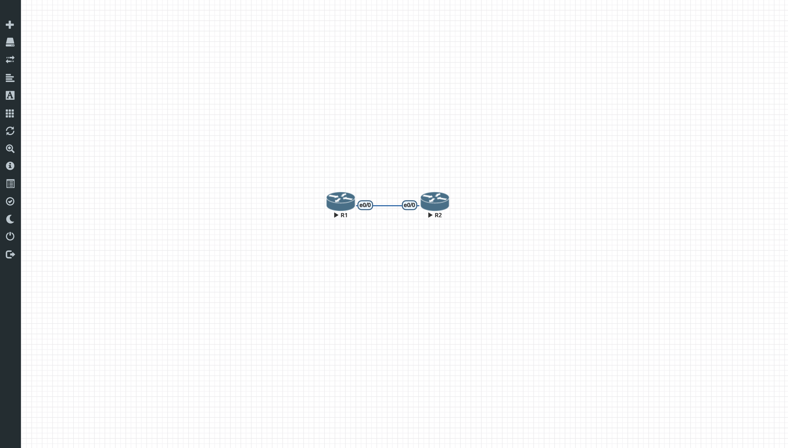

# 01: Point-to-Point Core Link with OSPFv2

> **Author:** Kacper Młodziński | **Environment:** EVE-NG (Cisco IOL 15.0) | **Category:** Routing & Switching / CCNA

## Project Overview
This project demonstrates the deployment of a dedicated Layer 3 (L3) Point-to-Point core connection between two Cisco routers running Cisco IOL (IOS on Unix). 
The primary objective is to establish dynamic routing using OSPFv2 across the backbone area (Area 0), simulate local client subnets via Loopback interfaces, apply 
baseline administrative security hardening, and tune OSPF network types for correct subnet advertisement.

---

## Topology



---

## Addressing Table

| Device | Interface | IP Address / Prefix | Subnet Mask | Description |
| :--- | :--- | :--- | :--- | :--- |
| **R1** | Ethernet0/0 | `10.0.0.1/30` | `255.255.255.252` | Inter-router P2P transit link to R2 |
| **R1** | Loopback0 | `192.168.1.1/24` | `255.255.255.0` | Simulated local LAN subnet (Site 1) |
| **R2** | Ethernet0/0 | `10.0.0.2/30` | `255.255.255.252` | Inter-router P2P transit link to R1 |
| **R2** | Loopback0 | `192.168.2.1/24` | `255.255.255.0` | Simulated local LAN subnet (Site 2) |

---

## Key Configuration Principles

1. **Security & Management Hardening:**
   - **Privileged Access:** Enforced cryptographically hashed passwords using `enable secret`.
   - **Reversible Encryption:** Enabled `service password-encryption` to obfuscate plaintext passwords in configuration files.
   - **Console Line Protection:** Configured `line con 0` with authentication, `exec-timeout 0 0` for operational persistence in labs, and `logging synchronous` 
	to suppress unsolicited log disruptions during command input.
   - **DNS Lookup Mitigation:** Executed `no ip domain-lookup` to avoid CLI lockups resulting from mistyped commands.

2. **OSPFv2 Route Tuning:**
   - Explicitly assigned static router identifiers (`router-id 1.1.1.1` and `router-id 2.2.2.2`) for deterministic election behavior.
   - Applied `passive-interface Loopback0` to isolate client edge subnets from unneeded OSPF Hello broadcasts and multicast overhead.
   - Configured `ip ospf network point-to-point` on Loopback interfaces to override the default RFC 2328 `/32` host route advertisement, 
	propagating the full `/24` prefix into routing tables.

---

## Verification & Diagnostics

### 1. OSPF Adjacency State (`show ip ospf neighbor`)
Adjacency between R1 and R2 successfully reached convergence (`FULL` state):

```text
R1#show ip ospf neighbor 

Neighbor ID     Pri   State           Dead Time   Address         Interface
2.2.2.2           1   FULL/BDR        00:00:32    10.0.0.2        Ethernet0/0

2. OSPF Routing Table & End-to-End Connectivity
Route propagation confirmed for the remote client segment (192.168.2.0/24 via 10.0.0.2), 
followed by a successful bi-directional verification across virtual edge networks sourced directly from the Loopback interface:

R1#show ip route ospf
Codes: L - local, C - connected, S - static, R - RIP, M - mobile, B - BGP
       D - EIGRP, EX - EIGRP external, O - OSPF, IA - OSPF inter area 
       N1 - OSPF NSSA external type 1, N2 - OSPF NSSA external type 2
       E1 - OSPF external type 1, E2 - OSPF external type 2
       i - IS-IS, su - IS-IS summary, L1 - IS-IS level-1, L2 - IS-IS level-2
       ia - IS-IS inter area, * - candidate default, U - per-user static route
       o - ODR, P - periodic downloaded static route, H - NHRP, l - LISP
       + - replicated route, % - next hop override

Gateway of last resort is not set

O     192.168.2.0/24 [110/11] via 10.0.0.2, 00:19:33, Ethernet0/0

R1#ping 192.168.2.1 source loopback 0

Type escape sequence to abort.
Sending 5, 100-byte ICMP Echos to 192.168.2.1, timeout is 2 seconds:
Packet sent with a source address of 192.168.1.1 
!!!!!
Success rate is 100 percent (5/5), round-trip min/avg/max = 1/2/4 ms


# Cisco Network Engineering Lab Portfolio

[](#)
[](#)
[](#)

A practical collection of enterprise networking topologies, routing configurations, and security policies designed, implemented, and validated in an **EVE-NG** virtualized environment utilizing **Cisco IOL (IOS on Unix)** images.

---

## Lab Directory

| # | Project Title | Key Technologies | Status | Link |
| :-: | :--- | :--- | :-: | :-: |
| **01** | **Point-to-Point Core Link with OSPFv2** | OSPFv2 (Area 0), P2P Subnetting (/30), Loopback Tuning, Line Hardening | `Completed` | [View Project](./01-p2p-ospf-basic) |
| **02** | **VLAN Segmentation, 802.1Q Trunks & Inter-VLAN Routing** | L2 Switching, 802.1Q, Router-on-a-Stick (Subinterfaces), SVI | `Planned` | _Upcoming_ |

---

## Lab Environment Architecture
- **Hypervisor / Platform:** EVE-NG Bare-Metal / KVM
- **Images:** Cisco IOL Linux L2/L3 (I86BI_LINUX-JK9S-M)
- **Terminal Emulator:** Apple Terminal / Telnet & HTML5 Console

---

## Author
- **Kacper Młodziński** — [@subernetti](https://github.com/subernetti)